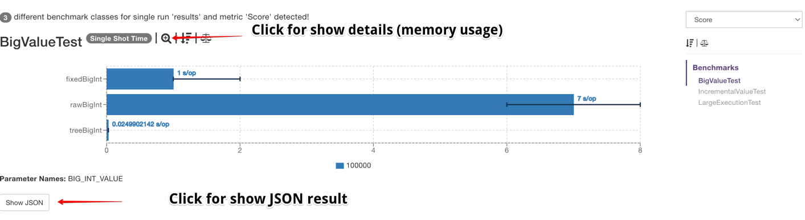
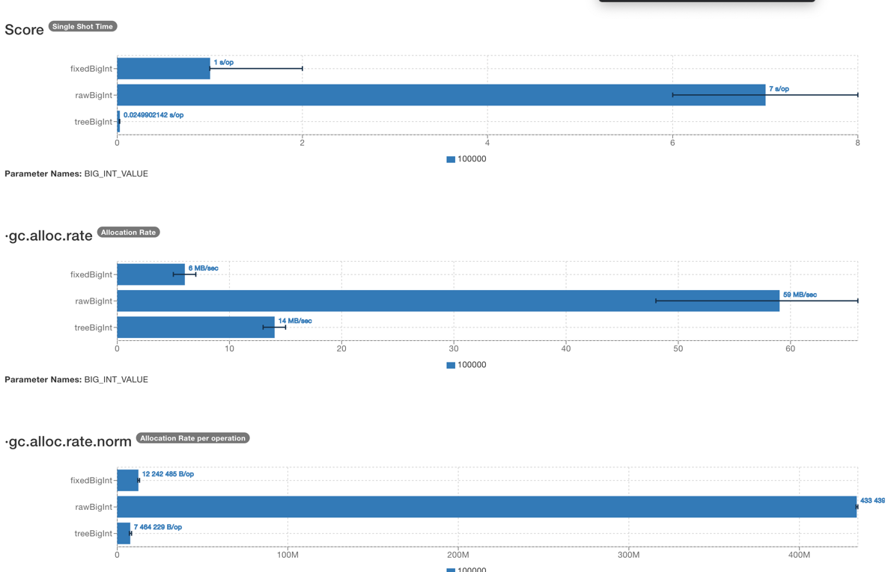

= JetBrains IDEA core test

This project was created for test prime calculator functionality.

== Project structure
history - folder for local save benchmark run results

src -> jmh - folder with benchmark tests

src -> main - folder with prime calculator implementations

src -> test - folder with functional test

== Usage

`gradle test` - for run functional JUnit tests. Result: build/reports/tests/test/index.html

`gradle jmh` - for run benchmark tests. Result: build/results/jmh/results.json

`gradle jmhReport` - create html report by JMH results. Automatically run after `gradle jmh`. Result: build/results/jmh/index.html

`gradle saveData` - save JMH run result into storage(history folder for local run/ database for CI run). Automatically run after `gradle jmh`

== Viewing a jmh report

Open report(build/results/jmh/index.html) in your browser. On main page you can see general information.

For viewing detail information click 'Shod details' button

